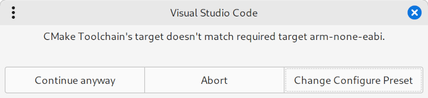
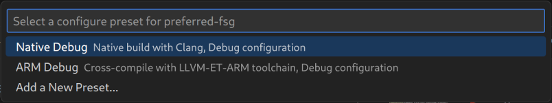

# CMake Tools Extras

Little odds and ends built on top of CMake Tools.

## Table of Contents

* [Command: `cmake-extras.ensure-toolchain-target`](#command-cmake-extrasensure-toolchain-target)
* [Task Type: `cmake-ensure-toolchain-target`](#task-type-cmake-ensure-toolchain-target)

## Command: `cmake-extras.ensure-toolchain-target`

Takes a single string argument, `target`, representing an architecture triplet `<machine>-<vendor>-operatingsystem>`, such as `arm-none-gnuabi` or `x86_64-pc-linux-gnu`. Returns an empty string.

Checks the configured CMake toolchain's target against the passed in `target`. If it doesn't match, prompts the user to change the selected CMake Configuration Preset.




The intended use for this command is on projects with configuration presets that target different architectures and use `${command:cmake.launchTargetPath}` in debug configurations that only work for a subset of the target architectures. By prepending it to the `executable` property, variable interpolation is paused while the user is given a chance to select a preset whose target architecture matches the debug configuration's needs.

### Example

```json
{
    "version": "0.2.0",
    "configurations": [
        {
            "name": "Debug with J-Link",
            "cwd": "${workspaceFolder}",
            // ${input:ensureARMToolchain} is evaluated first, and pauses
            // variable interpolation if the user needs to select a new
            // toolchain. It evaluates to an empty string, leaving the result
            // of ${command:cmake.launchTargetPath} as the entire value of
            // `"executable"`
            "executable": "${input:ensureARMToolchain}${command:cmake.launchTargetPath}",
            "request": "launch",
            "type": "cortex-debug",
            "servertype": "jlink",
            "device": "RM44L520",
       },
    ],
    "inputs": [
        {
            "id": "ensureARMToolchain",
            "type": "command",
            "command": "cmake-extras.ensure-toolchain-target",
            "args": "arm-none-eabi"
        }
    ]
}
```

### Post-change commands

Since dependent build presets and targets can become invalidated by a change in configure preset, `cmake-extras.ensure-toolchain-target` can take additional arguments specifying commands to run to prompt the user to select new values for those presets. The command arguments are the names of CMake Tools commands with the `cmake.` prefix removed.

```json
    "args": [ "arm-none-eabi", "selectLaunchTarget" ]
```

Good candidates for post-change commands include:
* `selectBuildPreset`
* `setDefaultTarget`
* `selectLaunchTarget`

### Specifying native target

CMake toolchains only have a target string associated with them by CMake Tools if they are cross-compiling toolchains (`CMAKE_CROSSCOMPILING=1`). To ensure that a native compilation toolchain is selected, pass `""` as the target.

```json
    "args": ""
```

## Task Type: `cmake-ensure-toolchain-target`

This offers the same functionality as [the `cmake-extras.ensure-toolchain-target` command](#command-cmake-extrasensure-toolchain-target), but as a task that can be configured in `tasks.json` and run with the `Tasks: Run Task` command.

The target is configured in the `target` property, and any post-change commands to run are listed in the optional `postChangeCommands` property.

```json
{
    "label": "CMake: Ensure ARM Toolchain",
    "type": "cmake-ensure-toolchain-target",
    "target": "arm-none-eabi",
    "postChangeCommands": [ "selectLaunchTarget" ]
}
```

Note that this is probably not what you want for a debug configuration's `preLaunchTask`, because all variable interpolation will already have taken palce by the time the task runs, meaning `${command:cmake.launchTargetPath}` will already have been resolved to a probably-wrong value. (I had already added this feature by the time I figured that out, but since I'd already written it I left it in. Maybe you'll be the first one to find a use for it!)

<!--
## Extension Settings

Include if your extension adds any VS Code settings through the `contributes.configuration` extension point.

For example:

This extension contributes the following settings:

* `myExtension.enable`: Enable/disable this extension.
* `myExtension.thing`: Set to `blah` to do something.

## Known Issues

Calling out known issues can help limit users opening duplicate issues against your extension.

## Release Notes

Users appreciate release notes as you update your extension.

### 1.0.0

Initial release of ...

### 1.0.1

Fixed issue #.

### 1.1.0

Added features X, Y, and Z.

---
-->
